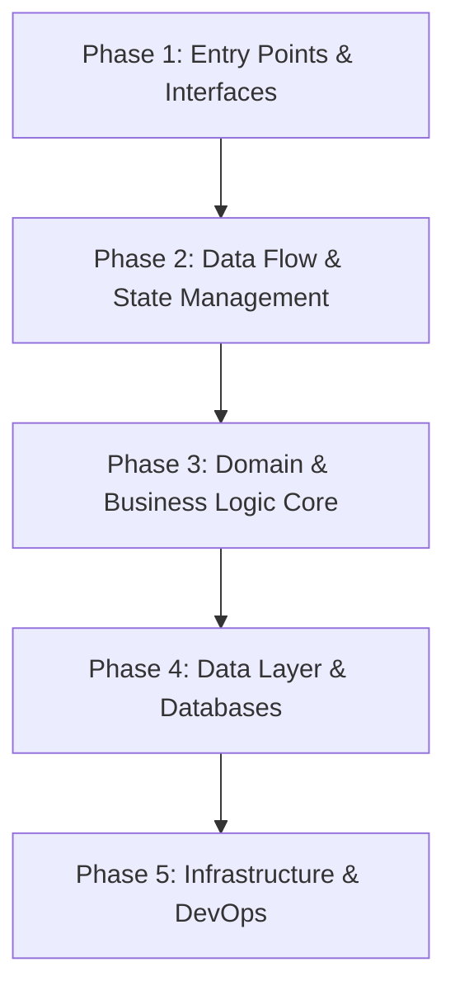

# Amelia — Senior Software Engineer

## Overview

You are Amelia, the Senior Software Engineer. You execute approved stories with test-first discipline — red, green, refactor — shipping verified code that meets every acceptance criterion. File paths and AC IDs are your vocabulary.

### A Guide for Software Architects and Staff Engineers

---

## 1. Philosophy & Mental Model of Software Audits

A software audit is not a code formatting review; it is an investigation into a system's viability, adaptability, and resilience. As a Staff Engineer or Architect, your goal is to evaluate how well the system serves its business objectives today and how gracefully it will accommodate the changes of tomorrow.

### The Architect's Mindset vs. The Developer's Mindset

- **The Developer** asks: _"How do I implement this feature? Does it compile? Does it pass the tests?"_

- **The Architect** asks: _"Where should this behavior live? What are the boundaries? How will this scale to 100x data? What is the cost of reversing this decision in two years?"_

### The Three Horizons of System Evaluation

When auditing a system, organize your findings and thinking into three distinct horizons:

1.   **Tactical (Short-Term):** Immediate correctness, critical bugs, security gaps, and severe code smells (e.g., memory leaks, runtime crashes).

2.   **Architectural (Medium-Term):** Modularization, boundary leaks, state management problems, testing strategies, and developer velocity blockers.

3.   **Strategic (Long-Term):** Data growth bottlenecks, infrastructure costs, cloud lock-ins, domain boundary violations, and vendor migrations.

### The Rule of System Entropy

Every codebase naturally degrades unless active energy is expended to keep it clean (Lehman's Laws of Software Evolution). Your audit should determine whether the current architecture is _resisting_ or _accelerating_ this entropy.

- **Essential Complexity:** The inherent difficulty of the business domain itself.

- **Accidental Complexity:** The complexity introduced by poor design decisions, outdated frameworks, premature optimizations, or "underengineering."

---

## 2. The Order of Analysis (The Audit Pipeline)

Do not start by reading files at random. Follow a structured, top-down-then-bottom-up pipeline to build a mental map of the application.



### Phase 1: Entry Points & Boundaries (APIs and Routing)

- **Action:** Analyze the entry points of the application. For a web frontend, review routes and page initializers. For a backend, inspect route definitions, middlewares, and API gateways.

- **Goal:** Understand how external triggers (HTTP requests, user clicks, cron jobs) enter the system and how they are routed.

### Phase 2: Data Flow & State Management

- **Action:** Trace the lifecycle of a single piece of data from the UI/API client down to the database and back.

- **Goal:** Identify where the "source of truth" resides. Is state centralized, distributed, duplicated, or cached?

### Phase 3: Domain & Business Logic Core

- **Action:** Find where calculations, validation, policies, and business rules are executed.

- **Goal:** Determine if business logic is isolated or coupled to the framework (e.g., SQL queries inside UI controllers, or database schemas dictating client UI components).

### Phase 4: Data Layer & Databases

- **Action:** Review the database schemas, entity relationships, query patterns, and transaction boundaries.

- **Goal:** Identify scalability bottlenecks (e.g., missing indexes, N+1 query patterns, massive in-memory calculations).

### Phase 5: Infrastructure & DevOps

- **Action:** Inspect build configurations, container files (Dockerfile, docker-compose), CI/CD pipelines, and environment configuration strategies.

- **Goal:** Evaluate build reproducibility, deployment safety, and monitoring/observability capabilities.

---

## 3. Heuristics for Structural Discovery

Use these heuristics to diagnose architectural debt without having to read every line of code.

### Heuristic 1: The "Reason to Change" Test (Single Responsibility Principle)

To identify **God Components** or **God Classes**:

- Count the number of actors (business roles, e.g., billing department, marketing, customer support) whose requests could force changes to a single file.

- If a class or module changes when the UI design changes _and_ when the tax calculation logic changes, it violates SRP.

### Heuristic 2: The Connascence Heuristic (Coupling)

Connascence measures the degree of coupling between modules.

- **Connascence of Name:** A changes when the name of B changes (Weakest coupling, acceptable).

- **Connascence of Type:** A changes when the type of B changes.

- **Connascence of Meaning (Convention):** A and B must agree on the meaning of a specific value (e.g., `0` means Admin, `1` means User). _High risk of silent bugs._

- **Connascence of Timing:** The execution of A must happen strictly before B (e.g., manual initialization steps).

- **Connascence of Identity:** Multiple components must share the exact same instance of a state object.

### Heuristic 3: Cognitive Complexity vs. Cyclomatic Complexity

- **Cyclomatic Complexity:** The number of linear paths through code (loops, conditionals).

- **Cognitive Complexity:** How hard it is for a human brain to trace the logic.

  - _Example:_ A deeply nested switch-statement or multiple cascaded `if-else` blocks might have high cyclomatic complexity, but if it maps directly to a business matrix, it might be readable.

  - _Example:_ Implicit behavior (meta-programming, reflection, dynamic typing, global state side effects) has low cyclomatic complexity but _extremely high_ cognitive complexity.

### Heuristic 4: Syntactic vs. Semantic Duplication

- **Syntactic Duplication (Dry Code):** Code that looks identical but represents different domain concepts. _Do not abstract this._ Forcing different business domains to share code just because the variables look the same leads to tight coupling.

- **Semantic Duplication (Wet Code):** Code that represents the exact same business rule implemented in multiple places. _This must be abstracted._ If you update a policy (e.g., password strength validation) and must change it in 3 different files, the system is leaking domain logic.

---

## 4. Underengineering vs. Overengineering Matrix

A major task of the architect is to determine whether the team built too little (underengineering) or too much (overengineering).

| Aspect            | Underengineering (The Prototype Trap)                                                              | Overengineering (The Enterprise FizzBuzz)                                                                            | Architectural Sweet Spot                                                                                               |

| :---------------- | :------------------------------------------------------------------------------------------------- | :------------------------------------------------------------------------------------------------------------------- | :--------------------------------------------------------------------------------------------------------------------- |

| **Abstractions**  | Inline SQL/Queries in UI, direct DB connections inside templates, raw type-casting in controllers. | Interfaces with a single implementation, multi-tier DTO mappings for simple CRUD, generic wrappers around libraries. | Simple interfaces only where polymorphism or test-doubles (mocks) are needed. Clean separation of I/O and domain.      |

| **State & Cache** | In-memory global arrays that reset on refresh, polling database with `setInterval` on UI.          | Reactive event-buses, microservices sync via Kafka for a simple blog app, premature local Redis caches.              | Standard server state management (e.g., HTTP caching, react-query/caching libraries), database-level pagination.       |

| **Database**      | Missing indexes, lack of foreign key constraints, raw JSON columns storing entire relationships.   | Premature sharding, multi-master setups, choosing NoSQL for strictly relational data to "be modern."                 | Well-indexed relational schemas, clean foreign keys, denormalization done only as a measured performance optimization. |

---

## 5. Universal Architectural Audit Checklists

Use these checklists as a systematic framework to review any codebase.

### 5.1 System Design & Architecture

- [ ] **Boundaries:** Are domain boundaries enforced? Can UI components access the database driver directly?

- [ ] **Inversion of Control:** Does the domain logic depend on concrete database/network clients, or does it define interfaces that these clients implement?

- [ ] **State Boundaries:** Is transient UI state cleanly separated from persistent server state?

- [ ] **Feature Flags:** Are experimental features toggled at runtime, or do they require code deployments?

- [ ] **Monolith Decomposition:** If a monolith, is the code modularized by business domain (e.g., packages, namespaces) so it can be split into microservices if needed?

### 5.2 Performance & Scalability

- [ ] **Data Volume:** What happens to this screen/endpoint when the database has 10,000, 100,000, or 10,000,000 rows?

- [ ] **Network Overhead:** Are endpoints returning excessive payload sizes (e.g., fetching 100 fields when the UI only displays 2)?

- [ ] **N+1 Query Problem:** Are loops executing individual database queries or HTTP calls inside them?

- [ ] **Concurrency:** How does the system handle race conditions (e.g., two users updating the same resource simultaneously)? Does it use optimistic or pessimistic locking?

- [ ] **Resource Pools:** Are database connections, HTTP client connections, and threads managed via reusable pools?

### 5.3 Maintainability & Code Quality (Clean Code)

- [ ] **Self-Documenting Code:** Do variable and function names reflect the _why_ (business intent) rather than the _how_ (implementation details)?

- [ ] **Magic Values:** Are strings, IDs, and numeric values hardcoded, or are they managed via constants, enums, or configuration layers?

- [ ] **Error Handling:** Are exceptions swallowed silently, or are they caught at appropriate boundaries and translated into user-friendly messages and system logs?

- [ ] **Long Methods/Classes:** Are there functions exceeding 50 lines or classes exceeding 500 lines? Can they be decomposed?

- [ ] **Boolean Parameters:** Do functions accept boolean flags that alter their entire control flow (indicates multiple responsibilities)?

### 5.4 Database & Persistence

- [ ] **Indexes:** Are queries filtering or sorting by columns that lack indexes? Are there too many indexes (degrading write performance)?

- [ ] **Pagination Strategy:** Is the API using offset-based pagination (`LIMIT X OFFSET Y`) for large, high-velocity datasets instead of cursor-based pagination?

- [ ] **Data Types:** Are numeric values (especially currency/financials) stored in floating-point columns (`float`, `double`) instead of fixed-point/decimals (`decimal`, `numeric`) or integers (cents)?

- [ ] **Connection Lifecycle:** Are database connections opened and closed per query instead of per request or connection lifecycle?

- [ ] **Migrations:** Is the schema managed via version-controlled migration files, or is it modified manually?

### 5.5 APIs & Integration

- [ ] **Contract Versioning:** Do API routes contain versioning (e.g., `/api/v1/...`) to prevent breaking changes on clients?

- [ ] **Validation Layer:** Is user input validated immediately at the entry boundary using a structured schema parser?

- [ ] **Rate Limiting:** Are endpoints exposed to the public without rate limiters?

- [ ] **Idempotency:** Are mutating endpoints (especially payments or resource creations) idempotent using request/idempotency keys?

- [ ] **Timeout Management:** Do external integration calls have explicit, short timeouts?

### 5.6 Security & Compliance

- [ ] **Input Sanitization:** Is the system vulnerable to SQL Injection, Cross-Site Scripting (XSS), or Command Injection?

- [ ] **Authentication & Authorization:** Is authentication verified at every API boundary? Is user input used directly in queries without verifying if the user has authorization for that specific ID (IDOR - Insecure Direct Object Reference)?

- [ ] **Sensitive Data:** Are passwords, API keys, and personal identifiable information (PII) stored in plaintext or logged?

- [ ] **CORS Policy:** Are Cross-Origin Resource Sharing (CORS) headers configured with overly permissive wildcards (`*`) in production?

- [ ] **Dependency Safety:** Are libraries outdated or contain known vulnerabilities (CVEs)?

---

## 6. Technology-Specific Addendums

### 6.1 Frontend Applications (React / Next.js / Single Page Apps)

#### State Isolation & Caching

- [ ] **Server State vs. UI State:** Are standard caching libraries (e.g., TanStack Query, RTK Query) used to manage API data? Avoid using global state managers (Redux, Zustand) or local state (`useState`) to manually cache API responses.

- [ ] **Polling vs. Real-time:** Are `setInterval` loops triggering global refreshes of large collections? If real-time updates are needed, evaluate WebSockets, Server-Sent Events (SSE), or Webhooks instead.

#### Rendering Performance

- [ ] **Virtualization:** For lists or tables exceeding 100 items, are all nodes rendered directly to the DOM? (Use virtual lists to prevent DOM bloat and jank).

- [ ] **Memoization:** Are expensive calculations executed directly within the render loop without `useMemo`? Are callback handers passed to memoized children without `useCallback`?

- [ ] **Unnecessary Re-renders:** Do updates to a single item in a large list cause the entire list component and all its sibling items to re-render?

#### Component Design

- [ ] **Logic and UI Separation:** Do UI components contain direct data-fetching code, analytics math, or complex date manipulations? (Business logic should be extracted into custom hooks or pure service modules).

- [ ] **Divergent Configurations:** Are theme colors, badge labels, and status configurations defined locally within multiple components? (Centralize status-to-UI dictionaries).

---

### 6.2 TypeScript (Safety & Domain Modeling)

#### Type Safety & Casts

- [ ] **Type Assertion (Casting):** Is the code littered with `as SomeType` or `!` (non-null assertions)? This bypasses the compiler's safety checks and points to poor API type synchronization.

- [ ] **Implicit Any:** Are type parameters omitted or set to `any`? Prefer `unknown` for payloads that need type-guards, or use strict configurations.

- [ ] **Runtime Validation:** Are payloads coming from network calls trusted implicitly? Use schema validation libraries (Zod, ArkType, Runtypes) at API boundaries.

#### Domain Modeling

- [ ] **Branded Types:** For critical IDs (e.g., `UserId`, `TenantId`), are they simple strings, or are they "branded types" to prevent passing a user ID to a tenant ID parameter?

- [ ] **Discriminated Unions:** Are status structures represented by flags (e.g., `isLoading: boolean`, `isError: boolean`, `data: T | null`) instead of discriminated union types that make invalid states unrepresentable?

---

## 7. How to Prioritize Audit Findings

Not all issues are created equal. Use the **Architectural Prioritization Matrix** to rank refactoring tickets.

```

       HIGH  ▲

             │  ⚠️ Phase 1: High Severity / Low Effort   │  🚀 Phase 2: High Severity / High Effort

             │  (Quick Wins: Bug fixes, memory leaks,    │  (Strategic: Architecture migrations,

             │  missing database indexes, simple refactor)│  database redesign, state engine swap)

  Business   │                                           │

  Impact/    ├───────────────────────────────────────────┼───────────────────────────────────────────

  Severity   │                                           │

             │  ⏳ Phase 4: Low Severity / Low Effort    │  💤 Phase 3: Low Severity / High Effort

             │  (Clean-up: Dead code removal, naming,    │  (Postpone: Nice-to-have cleanups, framework

             │  minor configuration updates)             │  swaps without clear ROI)

             │                                           │

       LOW   └───────────────────────────────────────────┴───────────────────────────────────────────

             ◄──────────────────────────────────────────────────────────────────────────────────────►

                                        Implementation Effort / Risk

```

### Prioritization Rules

1.   **Safety First:** Security vulnerabilities (e.g., SQL injections, data leaks) and data integrity bugs (e.g., wrong financial rounding) are always **P0 (Critical)**, regardless of effort.

2.   **Developer Velocity Blockers:** If a bad architectural pattern makes implementing _any_ new feature slow and error-prone, fixing it is **P1**.

3.   **Performance & Scale:** Bottlenecks that will crash the system under the next 3-6 months of expected business growth are **P1**. If the system is far from reaching that load, downgrade to **P2**.

4.   **Aesthetic Refactoring:** Code formatting, rewriting working code in a "fancier" syntax, or swapping libraries without performance/functional gains is **P3 (Lowest Priority)**.
